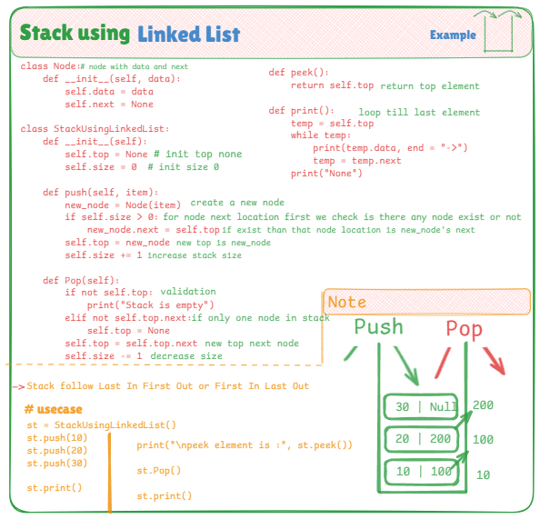

# 🧱 Stack Implementation Using Linked List

This project provides a manual implementation of a **Stack** using a **Linked List** in Python. Unlike array-based stacks, linked list stacks dynamically allocate memory and are more efficient for frequent insertions/removals.

---

## 📌 Stack Concept

A **Stack** is a linear data structure that follows the **Last-In-First-Out (LIFO)** principle. In this implementation, we use **nodes** where each node holds data and a reference to the next node. The `top` pointer always points to the last added element.

---

## 🧠 Key Highlights

- ✅ Built with custom `Node` class to represent each stack element
- ✅ Dynamically allocates memory (no fixed size)
- ✅ No use of built-in collections — purely logic-based
- ✅ Core operations include:
  - `push(item)` — Add a new node to the top
  - `pop()` — Remove the top node
  - `peek()` — Access the top node's value
  - `print()` — Traverse and print all elements from top to bottom

---

## 📷 Visual Explanation

This diagram shows how the linked list grows and shrinks with stack operations:

---

## 💡 Use Cases

- Memory-efficient alternative to list-based stacks
- Handling function calls and backtracking
- Used in low-level system designs (where arrays are costly)
- Useful in implementing undo features and parsing logic