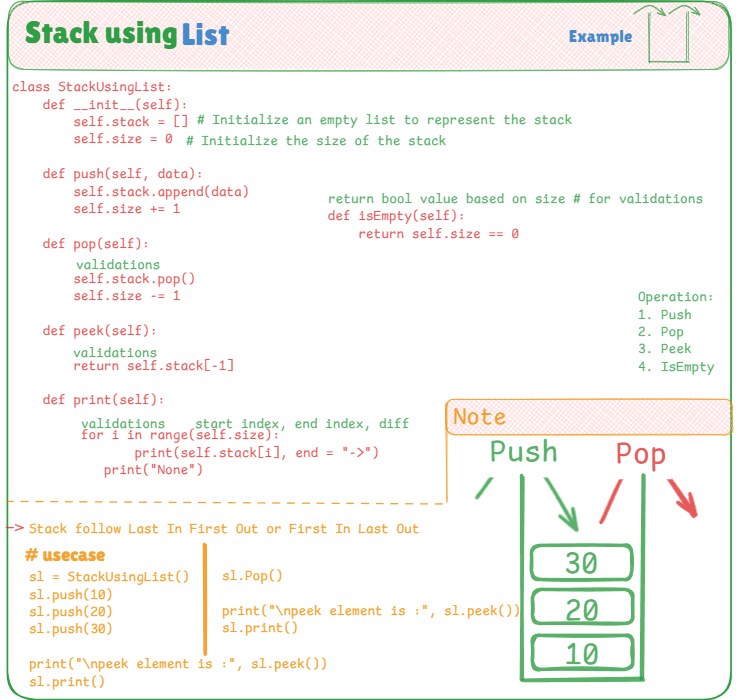

# 📦 Manual Stack Implementation Using List

This project demonstrates how to manually implement a **Stack** in Python using a list — without using any built-in stack libraries or collections. The goal is to understand how push, pop, peek, and print operations work internally in a Last-In-First-Out (LIFO) structure.

---

## 📌 Stack Concept

A **Stack** is a linear data structure that follows the **Last-In-First-Out (LIFO)** principle. The element added last is the one that is removed first. It is used in scenarios like undo features, recursion stacks, parsing expressions, etc.

---

## 🧠 Key Highlights

- ✅ Built using Python **list**, mimicking real stack behavior
- ✅ Manual control of **size tracking**
- ✅ Includes essential operations:
  - `push(item)` — Add element to the top
  - `pop()` — Remove the top element
  - `peek()` — See the top element without removing it
  - `print()` — Print all elements from top to bottom
- ✅ Avoids Python built-in `collections` for educational clarity

---

## 📷 Visual Explanation

The image below visually represents:

- Stack growth from bottom to top
- Push and Pop operations
- What happens internally in the list
- Order in which elements are accessed



---

## 💡 Use Cases

- Call stack handling in recursion
- Undo/Redo features in applications
- Syntax parsing in compilers/interpreters
- Backtracking problems like mazes and puzzles

---

## 🧪 Example Code Usage

```python
sl = StackUsingList()
sl.push(10)
sl.push(20)
sl.push(30)

print("peek element is:", sl.peek())  # Output: 30
sl.print()                            # Output: 30->20->10->None

sl.pop()

print("peek element is:", sl.peek())  # Output: 20
sl.print()                            # Output: 20->10->None
