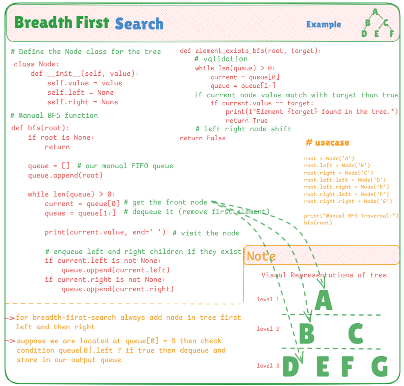

# 🌳 Manual Breadth-First Search (BFS) in Binary Tree

This file demonstrates how to manually implement **Breadth-First Search (BFS)** in a binary tree using Python — without using any built-in queue libraries or modules. The idea is to build a custom FIFO queue and traverse level-by-level (left to right) across the binary tree.

---

## 📌 BFS Concept

**Breadth-First Search** visits all nodes of a tree level-by-level from top to bottom and left to right. The left and right child of a node are enqueued and explored in order.

---

## 🧠 Key Highlights

- **Manual queue logic** using a Python list (`append()` and slicing)
- **Custom `Node` class** to represent each node in the binary tree
- **Separate function to search** an element using BFS
- Simple code that builds understanding from scratch

---

## 📷 Visual Explanation

The image below provides a full visual representation of:

- The tree structure (levels and children)
- The BFS traversal order
- The code involved for both traversal and search
- Notes and logic flow

---

## 💡 Use Cases

- Great for learning how queues work under the hood
- BFS is often used in shortest path problems, level-order tree traversal, and more
- This implementation avoids external libraries for better understanding of internal mechanics

---

## Input

   A
  / \
 B   C
/ \ / \
D E F  G  

## ✅ Output 

A B C D E F G
