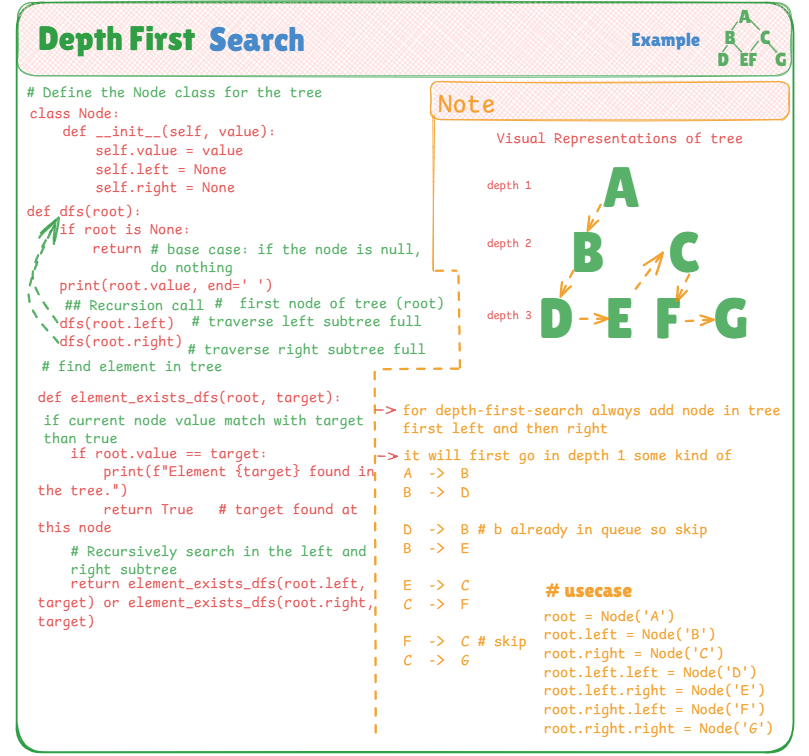

# 🌲 Manual Depth-First Search (DFS) in Binary Tree

This project demonstrates how to manually implement **Depth-First Search (DFS)** using recursion in Python to traverse a binary tree in a **preorder** manner (Node ➝ Left ➝ Right). Additionally, it includes a separate function to **search for an element** in the tree.

---

## 📌 DFS Concept

**Depth-First Search (DFS)** explores as far as possible along each branch before backtracking. The preorder variation visits a node, then its left subtree, followed by its right subtree.

---

## 🧠 Key Highlights

- **Recursive implementation**
- **Separate print and search functions**
- **Custom `Node` class** structure
- No external modules used — everything is written manually

---

## 📷 Visual Explanation

The following image visually explains:

- The tree structure (with levels and children)
- Preorder traversal path (DFS)
- How search works in DFS
- Clear notes and pointer arrows to enhance understanding

---

## 🔍 Use Cases of Depth-First Search (DFS):
1. Path Finding: DFS helps in finding paths from root to leaf or between any two nodes in a tree or graph.
2. Cycle Detection: It's used to detect cycles in graphs (especially in directed/undirected graphs).
3. Topological Sorting: In DAGs (Directed Acyclic Graphs), DFS is used for ordering tasks based on dependencies.
4. Maze/Game Solving: DFS can be used in puzzles, mazes, or games to explore all possible moves deeply before backtracking.