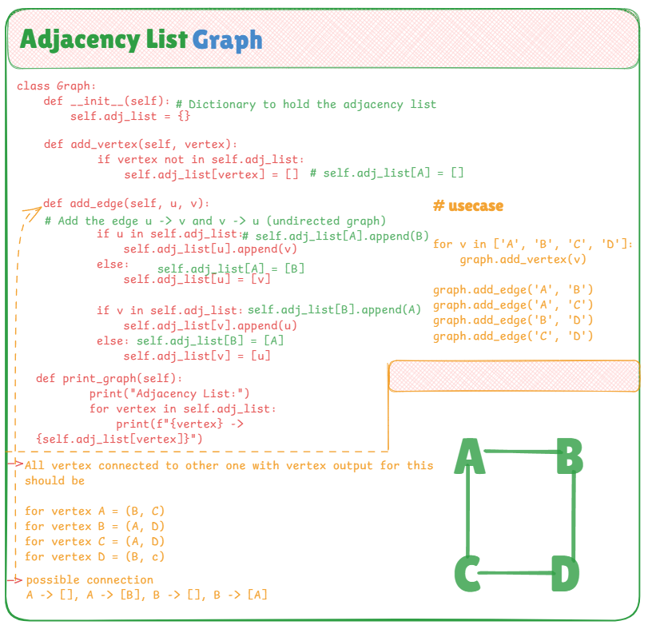

# 🔗 Manual Adjacency List Representation of Graph in Python

This file demonstrates how to manually implement a **graph using an Adjacency List** in Python — without using any built-in graph libraries like NetworkX. The idea is to build a flexible dictionary-based representation where each node keeps a list of its neighbors.

---

## 📌 Adjacency List Concept

An **Adjacency List** stores each node as a key, and its value is a list of connected vertices. This is especially efficient for sparse graphs and allows quick lookups of neighbors.

---

## 🧠 Key Highlights

- **Manual edge and vertex management** using Python dictionaries
- **Custom `Graph` class** to add vertices, edges, and print the graph
- Clear, expandable design — supports both directed and undirected graphs
- Beginner-friendly syntax and layout

---

## 📷 Visual Explanation

The image below provides a full visual representation of:

- The graph structure using nodes and edges
- How the adjacency list stores connections
- Sample edges used in the test case
- Logical flow of the graph building process



---

## 💡 Use Cases

- Representing relationships in **social networks**
- Modeling **web page link structures** or **computer networks**
- Efficient **graph traversal algorithms** like DFS/BFS
- **Dynamic graph building** in game maps or AI search trees

---

## ✅ Example Usage

```python
graph = Graph()

# Add vertices manually
for v in ['A', 'B', 'C', 'D']:
    graph.add_vertex(v)

# Add undirected edges
graph.add_edge('A', 'B')
graph.add_edge('A', 'C')
graph.add_edge('B', 'D')
graph.add_edge('C', 'D')

graph.print_graph()
