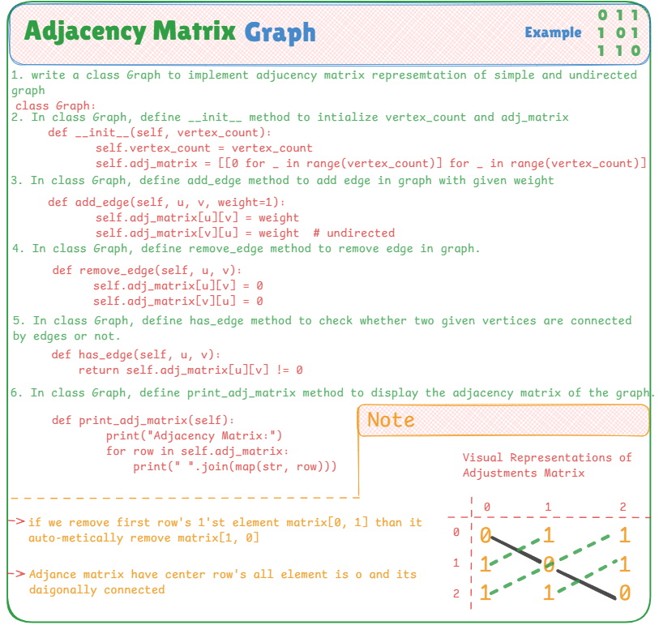

# 🧮 Manual Adjacency Matrix Representation of Graph in Python

This file demonstrates how to implement a **Graph using an Adjacency Matrix** in Python. The matrix approach is useful for dense graphs, and operations like checking for edge existence are performed in constant time.

---

## 📌 Adjacency Matrix Concept

An **Adjacency Matrix** is a 2D array (or list of lists) used to represent a graph. The matrix has rows and columns representing vertices, and the value at position `[i][j]` is:
- `1` if there's an edge from vertex `i` to `j`
- `0` otherwise

This approach works well for **undirected**, **simple** graphs — no self-loops or duplicate edges.

---

## 🧠 Key Highlights

- Manual matrix logic using a nested list
- Support for adding, removing, and checking edges
- Fast edge lookup (`O(1)` time)
- Visual and compact representation of connections

---

## 📷 Visual Explanation

The image below provides a full visual representation of:

- The matrix structure (rows vs columns)
- How connections are stored numerically
- Sample graph with 3 vertices and edges
- Logical flow of edge addition and visualization



---

## 💡 Use Cases

- Useful for **dense graphs** with many connections
- Great for **shortest path algorithms** like Floyd-Warshall
- Works well when edge existence queries are frequent
- Suitable for **graph simulations**, matrices, and quick math-based traversal

---

## ✅ Example Usage

```python
g = Graph(3)
g.add_edge(0, 1)
g.add_edge(1, 2)
g.print_adj_matrix()
