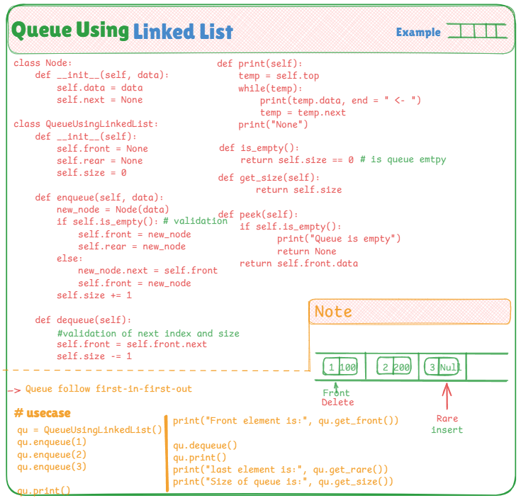

# 📦 Queue Implementation Using Linked List

This file showcases a **custom implementation of a Queue** in Python using a **linked list**. It follows the classic **FIFO (First-In-First-Out)** structure and is built from scratch — without using Python's built-in data structures for queues.

---

## 📌 Queue Concept

A **Queue** is a linear data structure where elements are inserted at the **rear** and removed from the **front**. This implementation uses a **singly linked list**, where each node contains data and a reference to the next node.

---

## 🧠 Key Highlights

- ✅ Custom `Node` class to represent queue elements
- ✅ Dynamically sized — no fixed capacity
- ✅ No shifting or resizing needed like arrays
- ✅ Tracks `front`, `rear`, and `size` of the queue
- ✅ Core operations include:
  - `enqueue(data)` → Add to the rear
  - `dequeue()` → Remove from the front
  - `print()` → Display all elements
  - `get_front()` / `get_rare()` → Get front or rear value
  - `get_size()` → Get the number of elements

---

## 📷 Visual Explanation

Here’s how the queue evolves:

---

## 💡 Use Cases

- Handling real-time tasks (e.g., printer queues, customer service)
- Thread-safe task scheduling
- Data buffering and streaming
- Tree and graph traversal algorithms
