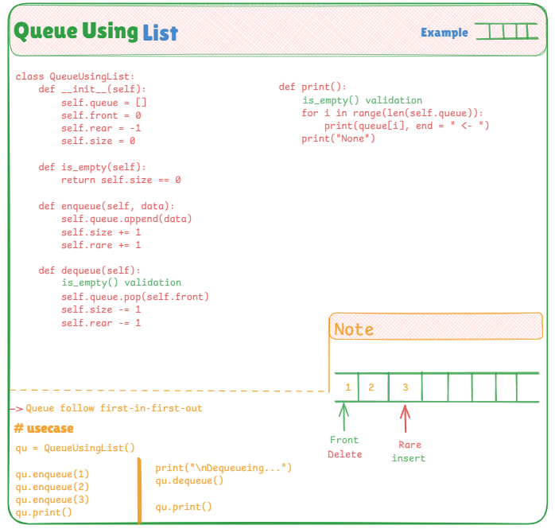

# 📦 Queue Implementation Using List (Custom Logic)

This file demonstrates how to implement a **Queue** in Python using a **list** with custom logic — no built-in queue modules or `collections.deque`. It’s a great way to understand the fundamentals of **FIFO (First-In-First-Out)** data structures.

---

## 📌 Queue Concept

A **Queue** is a linear data structure that follows the **First-In-First-Out (FIFO)** principle. The element that is enqueued first will be dequeued first. In this implementation, we track `front`, `rear`, and `size` manually to manage queue operations.

---

## 🧠 Key Highlights

- ✅ Manually manages `front`, `rear`, and `size`
- ✅ Uses a Python list to simulate queue behavior
- ✅ Custom implementation — no built-in queue usage
- ✅ Core operations include:
  - `enqueue(data)` — Add an item to the rear
  - `dequeue()` — Remove the front item
  - `print()` — Print all elements from front to rear

---

## 📷 Visual Explanation

This is how the queue evolves with enqueue and dequeue:

---

## 💡 Use Cases

- Managing request queues
- Handling asynchronous tasks
- CPU scheduling and buffering
- BFS traversal in graphs and trees